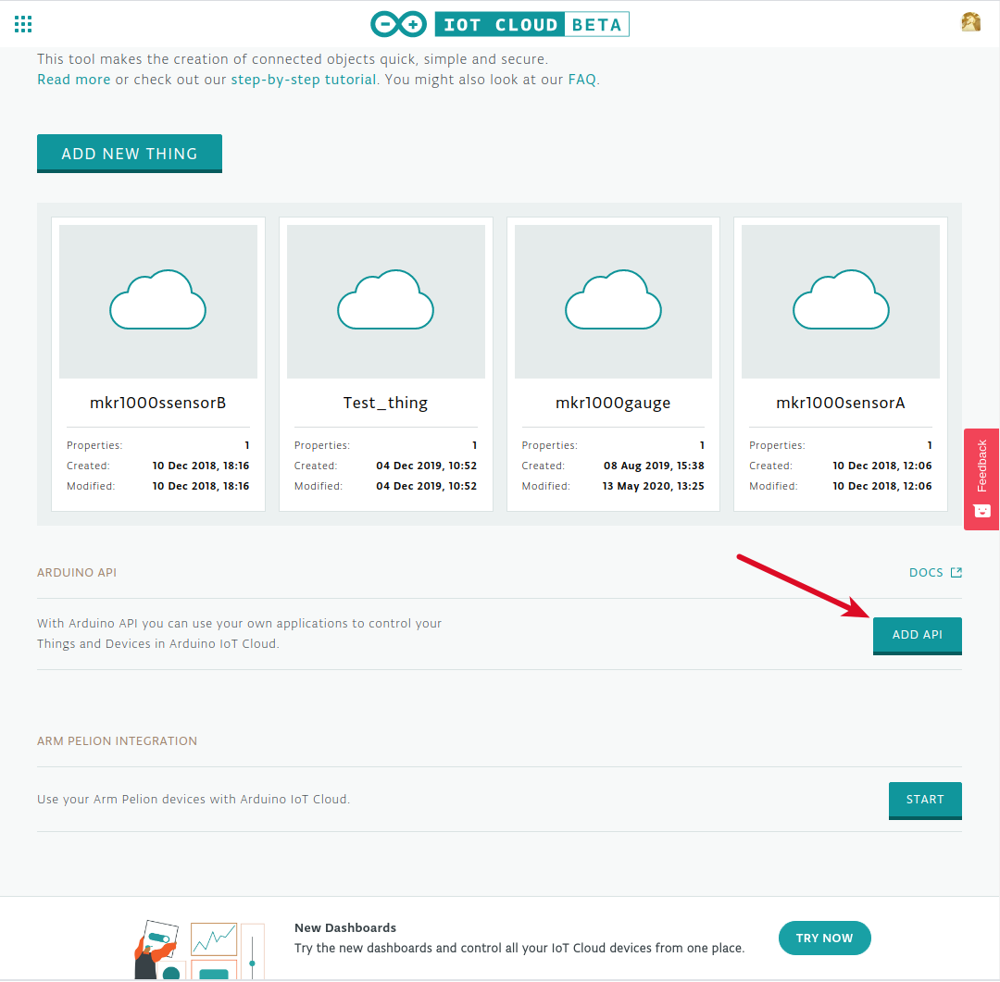
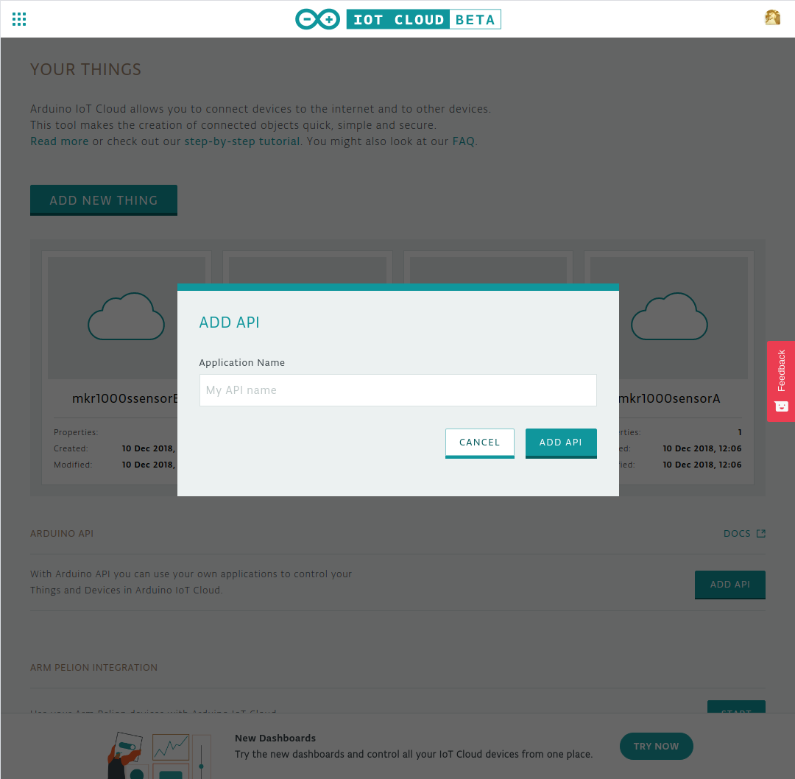
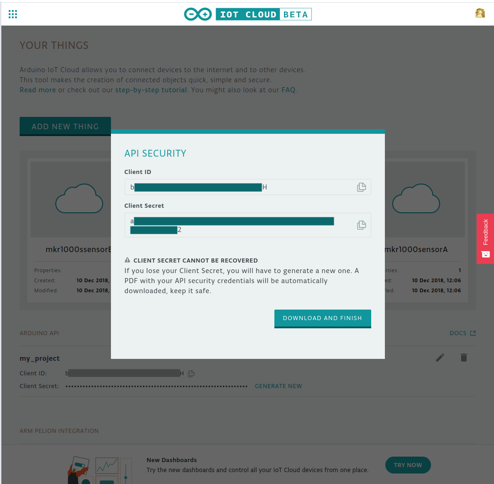

# Arduino iot-api Go client

## Getting Started

The client requires a valid access token to authenticate, you can use the
`golang.org/x/oauth2` to easily get one with the Client Credentials OAuth2 flow:

```Go
import cc "golang.org/x/oauth2/clientcredentials"

// We need to pass the additional "audience" var to request an access token
additionalValues := url.Values{}
additionalValues.Add("audience", "https://api2.arduino.cc/iot")
// Set up OAuth2 configuration
config := cc.Config{
    ClientID:       clientID,
    ClientSecret:   clientSecret,
    TokenURL:       "https://api2.arduino.cc/iot/v1/clients/token",
    EndpointParams: additionalValues,
}
// Get the access token in exchange of client_id and client_secret
tok, err := config.Token(context.Background())
if err != nil {
    log.Fatalf("Error retrieving access token, %v", err)
}
// Confirm we got the token and print expiration time
log.Printf("Got an access token, will expire on %s", tok.Expiry)
```

For a working example, see [the example folder](https://github.com/arduino/iot-client-go/tree/master/example) in this repo.


## How to get Arduino IoT Cloud Client Credentials

**NOTE:** Client Credentials are an Arduino IoT Cloud Maker Plan feature. Form more informations check the [Arduino Store](https://store.arduino.cc/digital/create).

You can generate Arduino IoT Cloud Client Credentials in the `ARDUINO API` section in the [IoT Cloud things dashobard](https://create.arduino.cc/iot/things):

### Step 1



### Step 2



### Step 3

